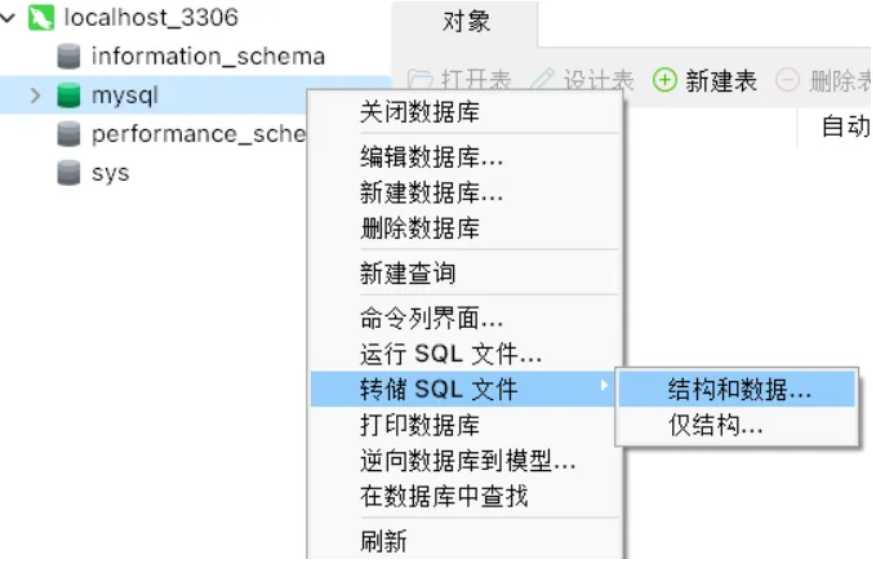
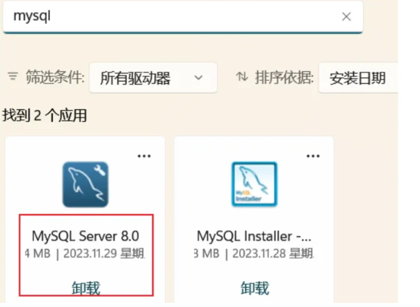
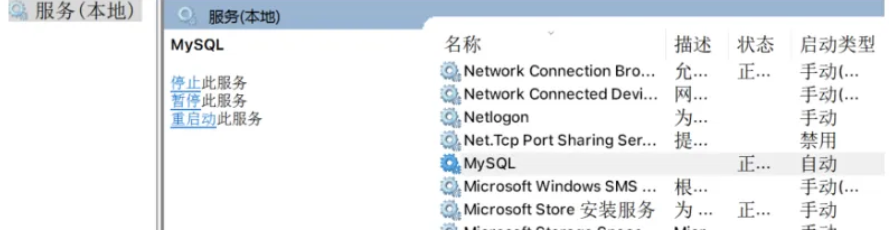

<figure style="display: flex; ">
    
    <figcaption style="max-width: 700px; white-space: normal;">
        <h1 style="margin: 0;">Windows MySQL版本更换、数据未备份丢失处理以及MySQL服务问题</h1>
        <span>💡 Tips!: **MySQL版本的更换近期处理涵盖重装推荐**</span>
    </figcaption>
</figure>

- **在进行更换之前，首先且最好对数据进行备份处理，这里拿Navicat16举例,双击需要导出的数据，确定为.sql文件（这几天在整理mysql因为懒复制data文件，后来更新版本等导致数据丢失/(ㄒoㄒ)/~~）**


更换前的处理，在管理员终端，停止服务。(若有终端均在管理员下运行)

```bash
net stop mysql
```

打开mysql的安装目录，全部删除（sql数据文件已备份！如果数据重要得确认已经导出）

这里删除的差不多了，剩下的还有需要在卸载程序，卸载Server服务。



之后 win+r,输入，检查是否有mysql，没有便可以了

```bash
services.msc
```



若依然有则

```bash
sc delete mysql
或者
mysqld -remove mysql
```

### **此时我们已经清除了mysql，接下来安装MySQL**

这一步安装强推，简单明了，亲自试过四遍均成功。

[2023 年 MySQL 8.0 安装配置 最简易（保姆级）*mysql8.0安装配置教程*mobeicanyue的博客-CSDN博客](https://blog.csdn.net/m0_52559040/article/details/121843945)

---

## **这里再说数据备份问题**

数据库里的数据要想恢复需要以下文件，如果没有得寄(′д｀ )…

1. **.frm 文件(表定义文件): 存储表的结构定义，包括字段名、数据类型等信息。**
2. **.ibd 文件(InnoDB 数据文件): 存储 InnoDB 存储引擎的数据内容，表的实际数据文件。**
3. .myd 文件(MyISAM 数据文件):存储 MyISAM 存储引擎的表数据。在 MySQL 8.0 及更高版本中，MyISAM 表可能没有 .myd 文件，而是由 .frm 和 .ibd 文件组成。
4. .myi 文件(MyISAM 索引文件): 存储 MyISAM 存储引擎的索引信息。
5. 日志文件(如二进制日志文件): 存储数据库操作的日志信息，可用于恢复数据到某个时间点。

这里有可以通过.ibd和.frm以及日志文件恢复的，其它恢复的基本很难了，尝试使用了 *dbseeker_frm1.0.zip* 进行恢复，发现通过恢复frm文件只有结构，没有数据，这里我尝试失败了，因为我只有.frm文件和日志文件。

没有备份数据库里的日志文件不要覆盖处理，容易导致启动mysql服务的时候失败，基本上处理只能重装处理，最快也最容易解决。

---
