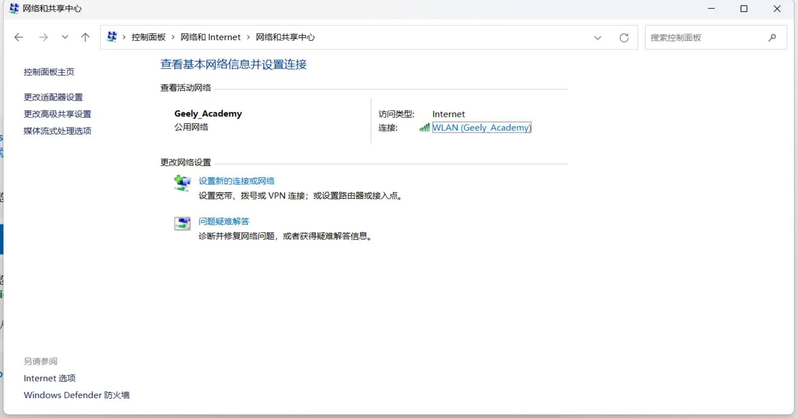
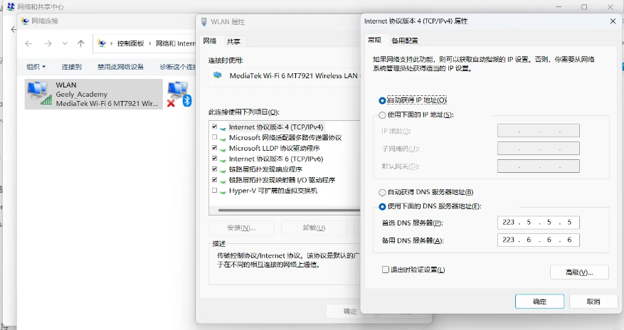
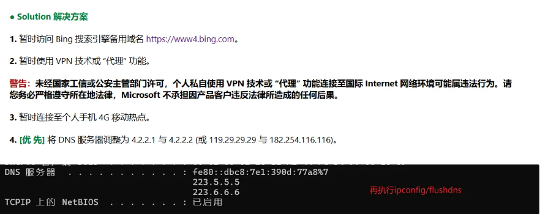
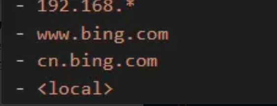

<figure style="display: flex; ">
    
    <figcaption style="max-width: 700px; white-space: normal;">
        <h1 style="margin: 0;">Windows 关于使用代理VPN但是无法访问bing有效的解决思路</h1>
        <span>💡 Tips!: **目前本机使用的是方法二**</span>
    </figcaption>
</figure>


### 方法一

简要说明两种方案，第一种是直接修改dns

<aside>
💡

`但是在之后我创建了一个新账户后失效`，于是后来我选在直接在代理商下手，详情看方案二

</aside>

国内使用 dns





国内直接修改为了阿里的dns服务器，较快，其他的参考，也是修改dns


刷新dns服务即可

```jsx
ipconfig/flushdns
```

### 方法二

如果以上方法无效<之前使用方法一的时候生效，后来该设备之后不可以了，于是便有了第二种方法，亲测有效>，使用该方法，修改系统代理，以小猫为例

在系统代理直接添加bing,例如


