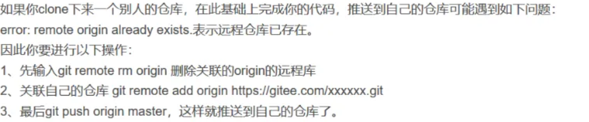

<figure style="display: flex; ">
    
    <figcaption style="max-width: 700px; white-space: normal;">
        <h1 style="margin: 0;">Git常见操作</h1>
        <span>💡Tips!: 三思而后行</span>
    </figcaption>
</figure>

# Git常见命令

## Git提交流程

```shell

## 如果是一个新建的空文件夹，要初始化一下本地仓库
git init

## 先链接远程仓库的origin，将这个仓库作为origin，这里的origin作为一个命名，可以是其他命名(比如我要链接两个仓库的时候，这里命名就会起到作用)
git remote add origin http://XXX.com/xxx/xxx.git/

## 检查并获取到最新你远程分支
git fetch

## 创建一个自己的分支并提交上去，通过本地分支的一个新命名，提交的时候会自动远程创建
git checkout `name`

## 检查当前仓库
git remote -v

## 更新全部，将代码加入到本地仓库    
git add * 
## 或者指定文件 
git add filename

## 提交到本地仓库
git commit -m "提交说明"   

## 若仓库没有之前没有一次提交历史信息，需要git pull 拉去当前分支最新代码或者强制推送覆盖远程 直接跳过这一步，在下一步中使用 --force或者-f 
git pull

## push到远程仓库名字为master分支上
git push origin `master`

```

## Git其他命令参考 

```shell
## 当无论如何都无法将本地最新提交到远程分支的时候
git rm -r --cached .

## **查看当前git仓库状态**  
git status

## 修改远程origin的git仓库地址
git remote set-url origin http://XXX.com/xxx/xxx.git/

## ----
## 在两个分支的历史记录没有共同祖先时，可能是因为您在本地的分支和远程的分支之间没有共同的提交历史。解决这个问题的一种方法是使用`--allow-unrelated-histories`选项来允许合并不相关的历史记录
git pull origin `name` --allow-unrelated-histories

## 使用上述无视后提交的下一步进行提交，例如将本地的A仓库推送到远程的B仓库
git push origin `A`:`B`

## 检查当前分支
git branch

## 切换分支
git checkout `name`

## 修改远程仓库名字(这里将test改为LearnNote)
git remote rename test LearnNote

## 假如想要将当前本地的test分支推送到远程仓库,假如远程没有master则会自动创建
git push LearnNote test

## 创建并切换到分支
git checkout -b `main`

## 查看origin
git remote get-url origin
## 如果origin不正确，可以进行删除
git remote set-url origin <new_remote_repository_url>

## 在远程仓库创建分支
## 也可以直接提交，使用无中生有
## 比如直接进行提交push，只需要后边跟上新的分支名即可
git push origin <branch-name>
git push origin HEAD:model

## 检出远程仓库创建的分支到本地
git checkout <branch-name>

## 查看当前remotes
git remote -v

## 修改remotes
git remote set-url origin + git地址

## 删除当前地址
git remote rm origin

## 新增地址
git remote add origin + git地址

```

# **文件夹修改仓库地址**


删除当前文件夹项目中的.git(慎重)

```bash
Remove-Item -Recurse -Force .git
```

# **origin和upstream**



## 简单介绍

origin指远程仓库的默认名字，可以任意命名，这个相当于把远程仓库的命名在本地换了一个简单易于理解的名字,之后在命令后边跟着的名字一般是分支名。